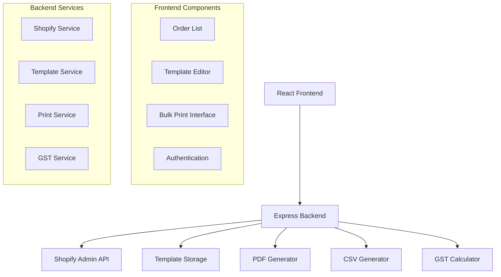

# Design Document

## Overview

The Shopify Order Printer application will be built as a web-based application using React for the frontend and Node.js/Express for the backend. The application will integrate with Shopify's Admin API to fetch order data and implement Indian GST calculation logic. The system will provide a template editor, order management interface, and bulk printing capabilities.

## Architecture

The application follows a client-server architecture with the following components:



## Components and Interfaces

### Frontend Components

#### 1. Authentication Component
- Handles Shopify OAuth flow
- Manages access tokens
- Provides login/logout functionality

#### 2. Order List Component
- Displays paginated list of Shopify orders
- Shows order details with GST breakdown
- Provides filtering and search capabilities
- Integrates with bulk print selection

#### 3. Template Editor Component
- Visual drag-and-drop template builder
- Live preview functionality
- Template save/load operations
- Customizable fields for business information

#### 4. Bulk Print Interface
- Date range picker
- Order selection interface
- Export format selection (PDF/CSV)
- Progress tracking for bulk operations

### Backend Services

#### 1. Shopify Service (`/api/shopify`)
- `GET /orders` - Fetch orders with pagination
- `GET /orders/:id` - Get specific order details
- `POST /auth` - Handle Shopify OAuth
- `GET /shop` - Get shop information

#### 2. Template Service (`/api/templates`)
- `GET /templates` - List available templates
- `POST /templates` - Save new template
- `PUT /templates/:id` - Update template
- `DELETE /templates/:id` - Delete template

#### 3. Print Service (`/api/print`)
- `POST /print/pdf` - Generate PDF for orders
- `POST /print/csv` - Generate CSV export
- `POST /print/bulk` - Handle bulk printing operations

#### 4. GST Service (`/api/gst`)
- `POST /calculate` - Calculate GST for order
- `GET /rates` - Get current GST rates
- `POST /breakdown` - Generate GST breakdown

## Data Models

### Order Model
```typescript
interface Order {
  id: string;
  orderNumber: string;
  createdAt: Date;
  customer: Customer;
  lineItems: LineItem[];
  shippingAddress: Address;
  billingAddress: Address;
  subtotal: number;
  total: number;
  gstBreakdown: GSTBreakdown;
}
```

### Customer Model
```typescript
interface Customer {
  id: string;
  firstName: string;
  lastName: string;
  email: string;
  phone: string;
}
```

### LineItem Model
```typescript
interface LineItem {
  id: string;
  productId: string;
  title: string;
  variant: string;
  quantity: number;
  price: number;
  hsnCode: string;
  size?: string;
  color?: string;
}
```

### Address Model
```typescript
interface Address {
  firstName: string;
  lastName: string;
  address1: string;
  address2?: string;
  city: string;
  province: string;
  country: string;
  zip: string;
}
```

### GST Breakdown Model
```typescript
interface GSTBreakdown {
  gstType: 'CGST_SGST' | 'IGST';
  gstRate: number;
  cgstAmount?: number;
  sgstAmount?: number;
  igstAmount?: number;
  totalGstAmount: number;
  taxableAmount: number;
}
```

### Template Model
```typescript
interface Template {
  id: string;
  name: string;
  layout: TemplateLayout;
  businessInfo: BusinessInfo;
  createdAt: Date;
  updatedAt: Date;
}

interface BusinessInfo {
  companyName: string;
  gstin: string;
  address: string;
  phone: string;
  email: string;
  logo?: string;
}
```

## GST Calculation Logic

The GST calculation follows Indian tax regulations:

1. **Rate Determination:**
   - Orders < ₹1000: 5% GST
   - Orders ≥ ₹1000: 12% GST

2. **Tax Type Determination:**
   - Same state (customer state = store state): Split into CGST + SGST (each 50% of total GST)
   - Different states: IGST (full GST amount)

3. **Calculation Flow:**
   ```typescript
   function calculateGST(order: Order, storeState: string): GSTBreakdown {
     const gstRate = order.total < 1000 ? 0.05 : 0.12;
     const taxableAmount = order.subtotal;
     const totalGstAmount = taxableAmount * gstRate;
     
     const customerState = order.shippingAddress.province;
     const isSameState = customerState === storeState;
     
     if (isSameState) {
       return {
         gstType: 'CGST_SGST',
         gstRate,
         cgstAmount: totalGstAmount / 2,
         sgstAmount: totalGstAmount / 2,
         totalGstAmount,
         taxableAmount
       };
     } else {
       return {
         gstType: 'IGST',
         gstRate,
         igstAmount: totalGstAmount,
         totalGstAmount,
         taxableAmount
       };
     }
   }
   ```

## Error Handling

### API Error Handling
- Shopify API rate limiting with exponential backoff
- Network timeout handling with retry logic
- Invalid authentication token refresh
- Malformed request validation

### User Error Handling
- Form validation with clear error messages
- Template editor validation
- File upload size and format restrictions
- Bulk operation progress and error reporting

### GST Calculation Error Handling
- Invalid state code handling
- Missing address information fallbacks
- Tax rate configuration validation

## Testing Strategy

### Unit Tests
- GST calculation logic validation
- Template rendering functions
- API service methods
- Utility functions

### Integration Tests
- Shopify API integration
- PDF generation with various templates
- CSV export functionality
- Authentication flow

### End-to-End Tests
- Complete order printing workflow
- Template editor functionality
- Bulk print operations
- GST breakdown accuracy

### Test Data
- Mock Shopify orders with various scenarios
- Different state combinations for GST testing
- Various order amounts for rate testing
- Template configurations for rendering tests

## Security Considerations

### Authentication
- Secure Shopify OAuth implementation
- Access token encryption and storage
- Session management with proper expiration

### Data Protection
- Customer data encryption in transit
- Secure API key storage
- Input validation and sanitization
- Rate limiting on API endpoints

### Compliance
- GDPR compliance for customer data
- Indian GST regulation compliance
- Shopify app security requirements